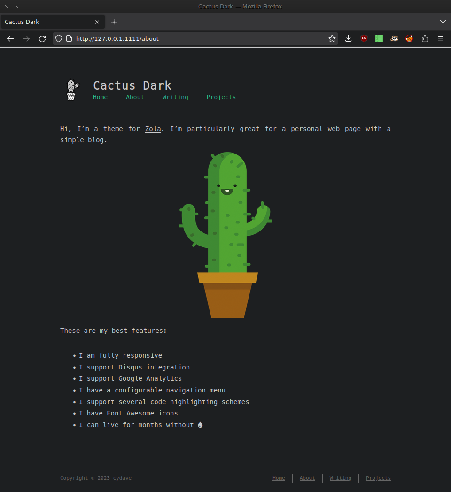
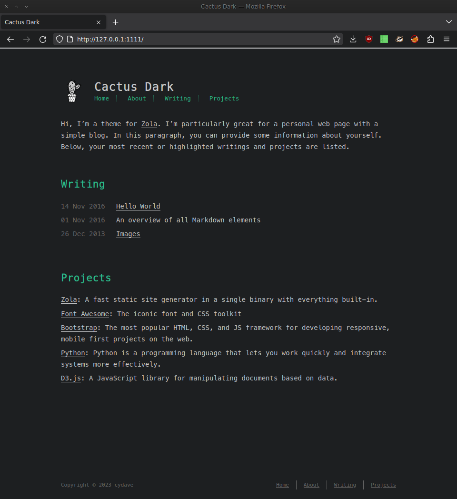

# Cactus

Cactus is a responsive, clean and simple theme ported to [Zola](https://www.getzola.org/).
This repo serves as a playground while I explore the capabilities of the Zola
static site generator. The original theme "Cactus" was developed by
[probberechts](https://github.com/probberechts) for [Hexo](http://hexo.io/).

## Screenshots

